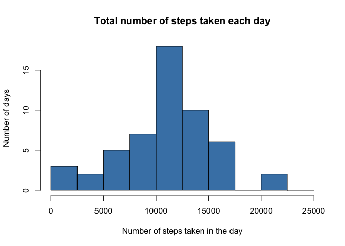
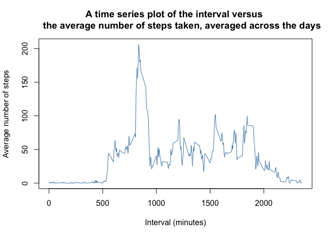
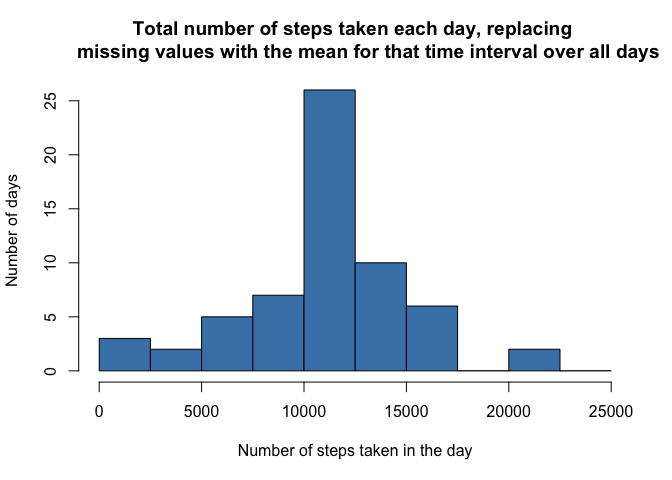
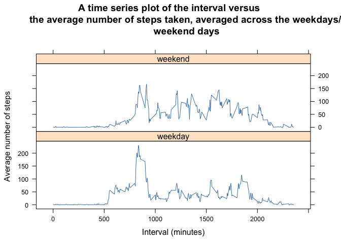

# Reproducible Research: Peer Assessment 1


## Loading and preprocessing the data

```r
library(chron)
df <- read.csv("activity.csv")
df$date <- as.Date(df$date, format="%Y-%m-%d")
```


## What is mean total number of steps taken per day?

Let's aggregate the data by the date, noting that we are permitted to omit any
NA's here


```r
stepsByDate <- aggregate(steps ~ date,df, FUN=sum, na.action=na.omit)
```

Then, let's make the plot:

```r
hist(stepsByDate$steps, 
     xlab="Number of steps taken in the day", 
     ylab = "Number of days", 
     breaks=seq(from=0, to=25000, by=2500),
     main="Histogram of Number of days with a given number of steps",
     col = "steelBlue")
```

<!-- -->

```r
options(scipen = 999, digits = "0")
stepsMean <- mean(stepsByDate$steps)
stepsMedian <- median(stepsByDate$steps)
```

The mean is 10766 steps per day, and the median is 10765 steps per day.

## What is the average daily activity pattern?
Aggregate steps by interval


```r
stepsByInterval <- aggregate(steps ~ interval,df, FUN=sum, na.action=na.omit)
```

and then plot the required time series plot


```r
plot(stepsByInterval$interval, stepsByInterval$steps, 
     type="l", col = "steelBlue")
```

<!-- -->

The five minute interval containing the most number of steps over all days is


```r
stepsByInterval[which.max(stepsByInterval$steps),1]
```

```
## [1] 835
```


## Imputing missing values
The total number of missing values in the dataset is 

```r
sum(is.na(df$steps))
```

```
## [1] 2304
```
Let's replace the NAs with the mean of that interval over all other days. 

```r
meanByInterval <- aggregate(steps ~ interval,df, FUN=mean, na.action=na.omit)
replaceNAs <- transform(df, steps=ifelse(is.na(df$steps), 
                    meanByInterval$steps[match(df$interval,
                    meanByInterval$interval)], df$steps))
```


```r
noNAsStepsByDate <- aggregate(steps ~ date, replaceNAs, FUN=sum)
```
Then plot the histogram

```r
hist(noNAsStepsByDate$steps, 
     xlab="Number of steps taken in the day", 
     ylab = "Number of days", 
     breaks=seq(from=0, to=25000, by=2500),
     main="Histogram of Number of days with a given number of steps, replacing 
     missing values with the mean for that time interval over all days",
     col="steelBlue")
```

<!-- -->

```r
options(scipen = 999, digits = "0")
noNAsStepsMean <- mean(noNAsStepsByDate$steps)
noNAsStepsMedian <- median(noNAsStepsByDate$steps)
```

The mean is 10766 steps per day, and the median is 10766 steps per day. By replacing missing values with the mean of the corresponding interval, the median steps per day shifts and becomes equal to the mean.

## Are there differences in activity patterns between weekdays and weekends?


```r
replaceNAs$weekday <- strftime(replaceNAs$date, format="%A")
replaceNAs$we <- ifelse(replaceNAs$weekday == "Saturday"|replaceNAs$weekday == "Sunday", "weekend", "weekday")
replaceNAs <- as.data.frame(unclass(replaceNAs))
# makes the two character columns into factors
```

```r
noNAsStepsByIntervalIsweekend <- aggregate(steps ~ interval + we, replaceNAs, mean)
```


```r
library(lattice)
xyplot(noNAsStepsByIntervalIsweekend$steps ~ noNAsStepsByIntervalIsweekend$interval | noNAsStepsByIntervalIsweekend$we, layout=c(1,2), type="l", col="steelBlue")
```

<!-- -->
